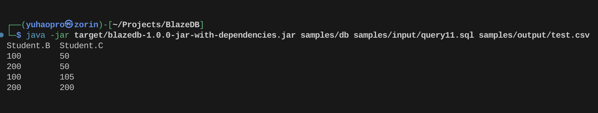

<h1 align="center">
  <br>
</a>

</h1>

<h4 align="center">A lightweight in-memory database CLI that supports basic SQL queries.</h4>

<p align="center">
    

</p>

<p align="center">
  <a href="#key-features">Key Features</a> •
  <a href="#how-to-use">How To Use</a> •
  <a href="#download">Download</a> •
  <a href="#credits">Credits</a>
</p>



## Key Features

* Support SQL queries involving selection and projection, distinct, sort by and group by.
    - Does not support partial projection for all columns. `SELECT Student.*, Enrolled.E FROM Student, Enrolled` 


```sql
SELECT * FROM Student;
SELECT Student.A FROM Student;
SELECT Student.A FROM Student WHERE Student.B > 5;
```
* Support join queries with join expression in the WHERE clause.
    - Does not support join queries using JOIN. `SELECT * FROM Student JOIN Enrolled ON Student.A = Enrolled.A`
```sql
SELECT * FROM Student, Enrolled;
SELECT * FROM Student, Enrolled WHERE Student.A = Enrolled.A
```
* Only supports `SUM` aggregations containing multiplication, column or literal.
```sql
SELECT SUM(Student.A * Student.A) FROM Student
SELECT SUM(1) FROM Student GROUP BY Student.A
```


## How To Use

To clone and run this application, you'll need [Git](https://git-scm.com) and [Java openJDK](https://jdk.java.net/java-se-ri/21) installed on your computer. From your command line:

```bash
# Install git
sudo apt install git

# Install java
sudo apt install openjdk-21-jre-headless:amd64

# Clone this repository
$ git clone https://github.com/yuhaopro/blazeDB

# Go into the repository
$ cd blazeDB

# Install dependencies
$ mvn clean compile assembly:single

# Run the jar file
$ java -jar target/blazedb-1.0.0-jar-with-dependencies.jar <db directory> <example.sql> <output.csv>
```


## Download

You can [download](https://github.com/amitmerchant1990/electron-markdownify/releases/tag/v1.2.0) the latest installable version of Markdownify for Windows, macOS and Linux.

## Credits

This is part of my advanced database coursework in the University of Edinburgh. Hope you like it! 

This software uses the following open source packages:

- [jsqparser](https://github.com/JSQLParser/JSqlParser)

## License

MIT

---
